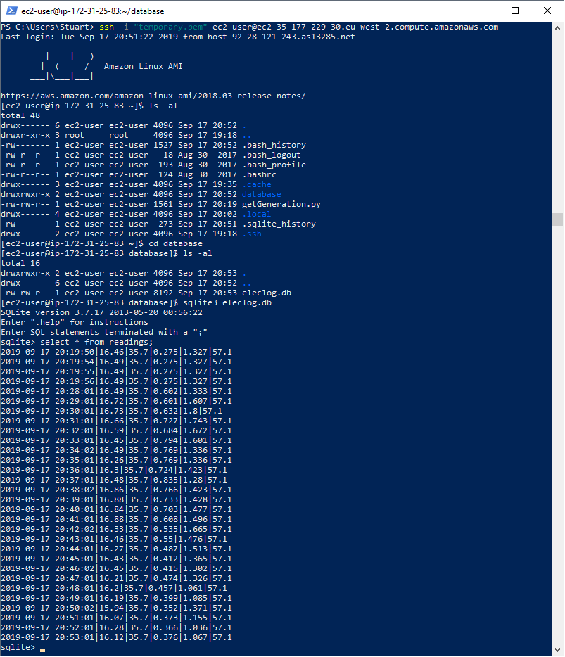
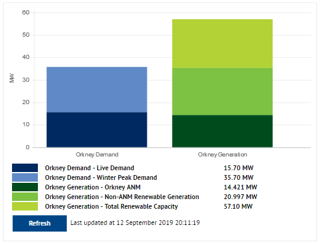
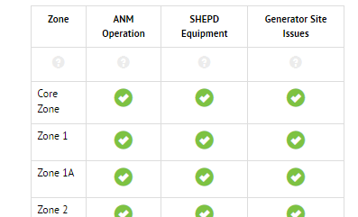

# Data logging

A live data feed of the current electricity demand and generation in the Orkney Isles is published by Southern Scottish Electricity Network https://www.ssen.co.uk/ANM/, along with information regarding the current state of the network https://www.ssen.co.uk/ANMGeneration/. 

The acronym ANM (active network management) refers to the management system, or 'SmartGrid', that prevents the network becoming overloaded during periods of high generation, i.e. windy days, by restricting generation (curtailment).  This allows additional generators to be active of less windy days, maximising network capacity.

Short python scripts have been written that read this electricity network information and log it to sqlite3 databases.
By use of 'cron' the scripts are run and data is logged every minute. ([SSEN data logging section](#ssen-data-logging))

Similarly, using the Met Office 'datapoint' API https://www.metoffice.gov.uk/datapoint historical weather observations(hourly) are logged each day (for the previous 24hours) and also, weather forecasts are logged every hour. ([Met Office data logging section](#met-office-data-logging))

An example cron file is included.

In this particular case, I have set up a Raspberry pi zerow as a datalogger. It has low power requirements, is small, inobtrusive and very reliable. It is easy to access and control via SSH and SFTP.

It is also possible to operate the data logger on an Amazon Web Services VM EC2 instance.


## SSEN data logging

### Generation data

python script: `getGeneration.py`

Based on https://github.com/tmrowco/electricitymap-contrib/blob/master/parsers/GB_ORK.py  by [systemcatch](https://github.com/systemcatch)

Digging into the SSEN webpage reveals that there is a webservice providing the electricity information. 

https://www.ssen.co.uk/Sse_Components/Views/Controls/FormControls/Handlers/ActiveNetworkManagementHandler.ashx?action=graph&contentId=14973&_=1537467858726

#### example of returned data :
``` json
{
    "data":{"labels":["Orkney Demand","Orkney Generation"],
         "datasets":[{"label":"Live Demand","backgroundColor":"#002961","data":[14.20,0.0]},
                     {"label":"Winter Peak Demand","backgroundColor":"#5f8ac7","data":[21.50,0.0]},
                     {"label":"Orkney ANM","backgroundColor":"#004b1c","data":[0.0,1.629]},
                     {"label":"Non-ANM Renewable Generation","backgroundColor":"#7dc242","data":[0.0,1.614]},
                     {"label":"Total Renewable Capacity","backgroundColor":"#b2d235","data":[0.0,53.857]}
                    ]
        },
 "yAxisLabel":"MW"
}
```

The webservice returns a JSON object with appropriate labels which can be easily read. However, the data is designed for drawing the webpage, and so some care must be taken to obtain the correct readings.

i.e. On the webpage the charts are made up of a number of stacked values which must be summed to obtain a total value.  In paticular, the total winter demand is made up of the current demand(dark blue area) and the difference between it and the maximum demand(light blue area). Similarly, the total renewable capacity is made up of non-ANM-generation (green area) ANM-generation (dark green area) and the difference (yellow green area).



### Network Status

python script: `getANMstatus.py`

Unlike the generation data, this must be scraped from the webpage itself.  The interesting data is contained within a single table with each row representing a complete record. 



The status is indicated by customised graphical symbols 'ok' 'warning' and 'remove'.


Using 'BeautifulSoup' the table, rows, and icon values are extracted.
The stored icon values are derived directly from the labels that are scraped from the page - this allows for unanticipated situations (e.g. new, different  icons) to be recorded accurately. 

To avoid recording uneccessary data, the whole dataset is stored in the sqlite3 database as a json string alongside a timestamp.  Additionally, data is only stored when the status has changed from the previous record.  i.e. The length of any status event can be inferred by comparing neighbouring entries. It is unclear whether this is a particularly good approach as, whilst it minimises the vlume of stored data, it involves much post-processing in order to merge with other datasets.   

## Met Office data logging

The met office provides an API for developers to allow access to a limited amount of weather records and observations for many sites across the UK.

The site I have chosen as most relevant for the project is Kirkwall Airport for which The Met Office provides both observations and forecasts. It is also fairly central to the area of interest in this project - The Orkney Isles. 

The unique metoffice site identifier for Kirkwall airport is '3017'.

Additionally, it is necessary to register with the service to receive a unique key in order to use the api.

### Weather observations
Met Office Datapoint has a webservice that provides hourly observations for the last 24 hours for approximately 140 locations across the UK.

https://www.metoffice.gov.uk/datapoint/product/uk-hourly-site-specific-observations/detailed-documentation

In this case, the site of interest is Kirkwall Airport, site id 3017.

The data is returned as json (although also available as xml), is clearly defined and labelled containing the following readings for each report throughout the day:

    Temperature (degrees Celsius)
    Wind direction (16 point compass)
    Wind speed (mph)
    Wind gust (mph)
    Dew Point (degrees Celsius)
    Screen Relative Humidity (%)
    Weather Type
    Visibility (m)
    Pressure (hPa)
    Pressure Tendency (Pa/s)
    
Where a parameter is not available no data is returned.

The python script 'getKirkwallWeather.py' is run using 'cronjob' once per day, that retrieves this data and stores it in an sqlite3 database. 

### Weather forecast
Met Office Datapoint has a webservice that provides site specific forecasts for each 3 hour period for the next 5 days.

https://www.metoffice.gov.uk/datapoint/product/uk-3hourly-site-specific-forecast/detailed-documentation

Again in this case, the site of interest is Kirkwall Airport, the forecast site_id is 352157.

By use of a logfile it was discovered that forecasts are revised and updated every hour.

The python script `getKirkwallForecast.py` is run using 'cron' every hour, retrieving this forecast data and storing it in an sqlite3 database.

To avoid recording uneccessary data, the whole dataset is stored in the sqlite3 database as a json string alongside a timestamp. It is unclear whether this is a particularly good approach as, whilst it minimises the volume of stored data, it will involve much post-processing in order to merge with other datasets.